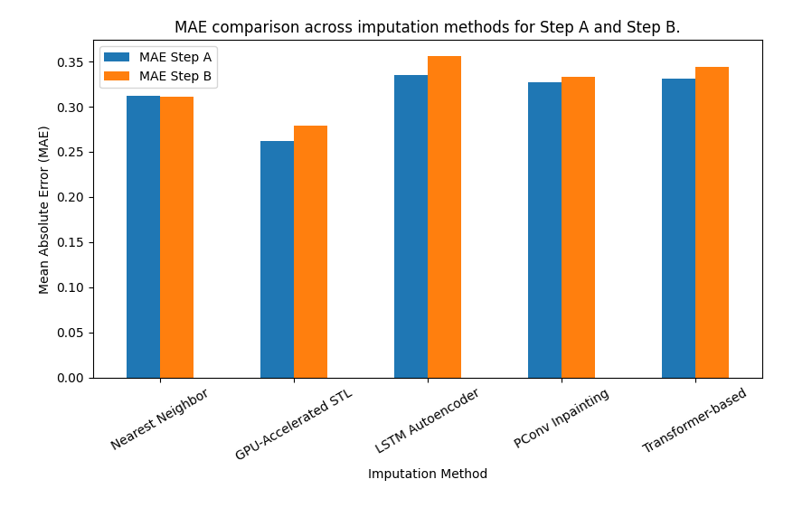

# Imputation de valeurs manquantes dans des séries temporelles de consommation électrique

Projet de data science du Master 1 DCI (Université Paris Cité, 2025), encadré par **Pr. Themis Palpanas**, réalisé dans le cadre d'un challenge Kaggle interne au master.

Des compteurs intelligents mesurent la consommation électrique de foyers toutes les 30 minutes. Une partie des mesures est manquante : l'objectif est de **reconstruire les valeurs masquées** avec l'erreur absolue moyenne (MAE) la plus faible possible.

## Données et scénarios

Chaque série couvre **12 864 points** (48 mesures par jour, environ 268 jours).

| Scénario | Entraînement | Test | Valeurs masquées | Difficulté |
|---|---|---|---:|---|
| **Step A** | 3 127 foyers complets | les **mêmes** 3 127 foyers | 30 % | exploiter l'historique du foyer |
| **Step B** | idem | 1 098 **nouveaux** foyers | 50 % | généraliser à des foyers jamais vus |

Les données du challenge ne sont pas redistribuées dans ce dépôt ; les notebooks les lisent depuis `/kaggle/input/`.

## Méthodes comparées

| Méthode | Principe |
|---|---|
| **Plus proche voisin** | pour chaque foyer de test, copier les valeurs du foyer d'entraînement le plus proche (MAE calculée sur les positions observées), en parallèle avec joblib |
| **STL accélérée sur GPU** | décomposition réimplémentée en PyTorch : tendance par moyenne mobile, saisonnalités journalière et hebdomadaire par médiane de phase ; part de l'imputation du plus proche voisin et affine les valeurs manquantes sur 30 itérations |
| **Autoencodeur LSTM** | reconstruction de fenêtres masquées |
| **Partial Convolution U-Net** | inpainting 1D : les convolutions ne voient que les valeurs observées (loss MAE masquée) |
| **Transformer** | imputation auto-supervisée par masquage, entraînement multi-GPU |

Un prétraitement commun écrête les valeurs aberrantes par la méthode IQR.

## Résultats

| Méthode | MAE Step A | MAE Step B |
|---|---:|---:|
| Plus proche voisin | 0,3124 | 0,3109 |
| **STL accélérée sur GPU** | **0,2621** | **0,2793** |
| Autoencodeur LSTM | 0,3350 | 0,3558 |
| PConv U-Net | 0,3266 | 0,3335 |
| Transformer | 0,3309 | 0,3442 |

La méthode statistique hybride **bat les trois modèles profonds** sur les deux scénarios. La STL apporte un biais inductif (saison + tendance) très adapté à la consommation électrique. Les modèles profonds, eux, ont dû être réduits pour tenir sur 4 GPU NVIDIA L4 face à des dizaines de millions de pas de temps. Le rapport détaille cette analyse.



## Contenu

```
notebooks/
  our_best_method.ipynb          # prétraitement, plus proche voisin, STL GPU (meilleure méthode)
  other_discussed_methods.ipynb  # autoencodeur LSTM, PConv U-Net, Transformer
report/
  report.pdf                     # rapport complet (anglais)
  main.tex + figures             # sources LaTeX
```

## Exécution

Les notebooks ont été exécutés sur **Kaggle** (4 × NVIDIA L4, PyTorch 2.5). Pour les relancer ailleurs, adapter les chemins `/kaggle/input/...` vers vos fichiers `train.csv` / `test.csv` (une ligne par foyer, une colonne par pas de temps).

```bash
pip install numpy pandas scikit-learn torch tqdm joblib matplotlib
```

## Licence

Code distribué sous [licence MIT](LICENSE).

## Auteurs

**Amar Merabti**, Kaci Sofiane Agouni et Aghilas Ould Braham — Master 1 DCI, Université Paris Cité, sous la direction de Themis Palpanas.
